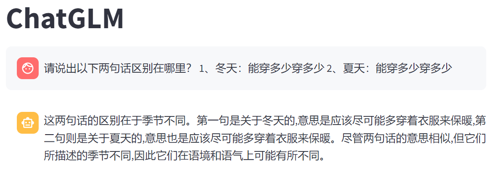

# AI导第四次作业
p.s. 仅针对魔搭平台的阿里云服务器
## 1. 部署并运行大模型
### 1.1 实验平台

魔搭平台

操作系统：Ubuntu

### 1.2 部署过程
使用conda配置依赖
```bash
conda create -n LLM python=3.10 -y
conda activate LLM
```
安装依赖
```bash
pip install \
torch==2.3.0+cpu \
torchvision==0.18.0+cpu \
--index-url https://download.pytorch.org/whl/cpu 

pip install -U pip setuptools wheel

pip install \
"intel-extension-for-transformers==1.4.2" \
"neural-compressor==2.5" \
"transformers==4.33.3" \
"modelscope==1.9.5" \
"pydantic==1.10.13" \
"sentencepiece" \
"tiktoken" \
"einops" \
"transformers_stream_generator" \
"uvicorn" \
"fastapi" \
"yacs" \
"setuptools_scm"

pip install fschat --use-pep517

pip install streamlit
```
安装LLM,本次使用两种模型：

Chatglm3-6b , Qwen-7B-Chat

每次选择一个大模型跑

```bash
cd /mnt/data
git clone https://www.modelscope.cn/ZhipuAI/chatglm3-6b.git
git clone https://www.modelscope.cn/qwen/Qwen-7B-Chat.git
```

### 1.3 运行

因为模型过大，所有每次仅支持一种模型的测试，在魔搭平台阿里云的远程主机上,每次选择不同的模型时，将不用的模型删除，然后下载想要测试的模型。

然后修改对应python代码的路径。例如：
```python
st.title("ModelName")

...

tokenizer = AutoTokenizer.from_pretrained(
    "path\to\your\model", 
    trust_remote_code=True
)
model = AutoModelForCausalLM.from_pretrained(
    "path\to\your\model",
    trust_remote_code=True,
    torch_dtype=torch.bfloat16
).eval()
```

然后在命令行运行：
```bash
streamlit run chat.py
```
然后就可以运行了。

## 2. 实验过程

### 2.1 git clone仓库

ChatGLM:


Qwen:


### 2.2 回答问题

Chatglm3-6b:



Qwen:


## 3. 横向对比

### 3.1 Question 1

chatglm 两句话均表示“多穿衣服保暖”，仅季节不同。未识别“穿多少”在冬夏的语义反转：
冬天指“尽可能多穿”，夏天指“尽可能少穿”。

qwen 明确点出冬天“多穿保暖” vs 夏天“少穿散热”。

qwen 正确捕捉中文双关语义，chatglm 忽略关键歧义。

### 3.2 Question 2

chatglm 仅分析句式结构（“一是谁” vs “谁看不上”），未触及语义双关。完全偏离问题本质（需解析“看不上”的主被动歧义）。

qwen指出双重含义：“自己看不上别人”,“别人看不上自己”，并分析情感色彩差异。

qwen 精准拆解语言陷阱，chatglm 停留于表面语法。

### 3.3 Question 3

chatglm 尝试解构语法但未给出明确答案，最终转向哲学讨论。

qwen直接声明信息不足无法回答。

两模型均未有效解决，但 qwen 的诚实回应更稳妥。

### 3.4 Question 4

chatglm 误将“明明”全视为人名，得出“白白喜欢他，但白白未表白”的结论。

qwen 正确解析：明明（主语）明白白白喜欢他 → 明明喜欢白白。但随后崩溃乱答。

wen 成功处理中文嵌套结构，chatglm 混淆词性导致逻辑崩塌。但都不对。

### 3.5 Question 5

chatglm 按出现顺序编号释义，但混淆“情感”与“态度”：例：将“小意思”误释为“谦虚情感”（应为“薄礼”）。未结合对话逻辑，释义脱离语境。

qwen-7B-Chat 紧扣对话进程，将“意思”统一解释为“意图/态度”：例：指出“不够意思”=“不讲情面”。误将“不好意思”释为“不客气”（应为“抱歉”）。

qwen 整体更贴近语境，chatglm 释义较散乱。

### 3.6 总结

在中文多义词解析、嵌套结构处理上显著优于 chatglm，且错误率更低。chatglm 的主要问题在于过度依赖表面语法而忽略语义灵活性。