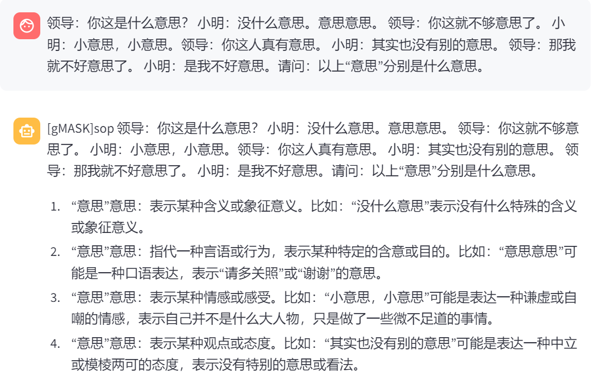

# AI导第四次作业
p.s. 仅针对魔搭平台的阿里云服务器
## 1. 部署并运行大模型
### 1.1 实验平台

魔搭平台

操作系统：Ubuntu

### 1.2 部署过程
使用conda配置依赖
```bash
conda create -n LLM python=3.10 -y
conda activate LLM
```
安装依赖
```bash
pip install \
torch==2.3.0+cpu \
torchvision==0.18.0+cpu \
--index-url https://download.pytorch.org/whl/cpu 

pip install -U pip setuptools wheel

pip install \
"intel-extension-for-transformers==1.4.2" \
"neural-compressor==2.5" \
"transformers==4.33.3" \
"modelscope==1.9.5" \
"pydantic==1.10.13" \

pip install fschat --use-pep517

pip install streamlit
```
安装LLM,本次使用三种模型：

Chatglm3-6b , Qwen-7B-Chat , BaiChuan2-7B-Chat.

每次选择一个大模型跑

```bash
cd /mnt/data
git clone https://www.modelscope.cn/ZhipuAI/chatglm3-6b.git
git clone https://www.modelscope.cn/qwen/Qwen-7B-Chat.git
git clone https://www.modelscope.cn/baichuan-inc/Baichuan2-7B-Chat.git
```

### 1.3 运行

因为模型过大，所有每次仅支持一种模型的测试，在魔搭平台阿里云的远程主机上,每次选择不同的模型时，将不用的模型删除，然后下载想要测试的模型。

然后修改对应python代码的路径。例如：
```python
st.title("ModelName")

...

tokenizer = AutoTokenizer.from_pretrained(
    "path\to\your\model", 
    trust_remote_code=True
)
model = AutoModel.from_pretrained(
    "path\to\your\model",
    trust_remote_code=True,
    torch_dtype=torch.bfloat16
).eval()
```

然后在命令行运行：
```bash
streamlit run chat.py
```
然后就可以运行了。

## 2. 实验过程

### 2.1 git clone仓库

ChatGLM:


Qwen:


### 2.2 回答问题

Chatglm3-6b:




Qwen:
